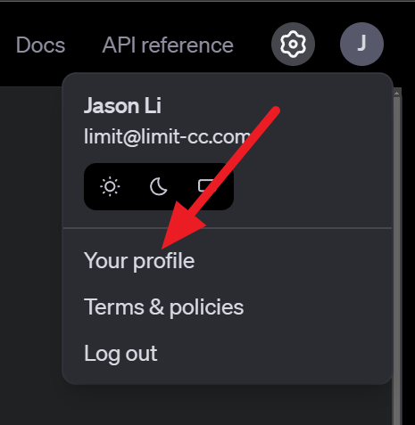

# OpenAI Audio API STT Component by Monoquark

## What is this for?
Uses the [OpenAI Audio API](https://platform.openai.com/docs/api-reference/audio/createTranscription) to perform transcription on incoming audio bytes using their latest whisper model model.

Note, alternative providers with a compatible API accepting wave audio can be used as well, see "Configuration" below.

## Setup

Windows
```
conda create -n jaison-comp-stt-openai-audio-api python=3.12
conda activate jaison-comp-stt-openai-audio-api
pip install -r requirements.txt
```

Unix
```
python -m venv venv
source venv/bin/activate
pip install -r requirements.txt
```

Furthermore, create a `.env` file in the root of this project with the following:
```
OPENAI_API_KEY=<openai api key like sk-...>
```
You can find you OpenAI API token [here](https://platform.openai.com/api-keys) as shown below:




An example `.env.example` file is provided.

## Testing
Assuming you are in the right virtual environment and are in the root directory:
```
python ./src/main.py --port=5000
```
If it runs, it should be fine.

## Configuration
In `config.json`, update parameters (`model`, `language`, `prompt`, `temperature`) according to the [OpenAI Audio API Documentation](https://platform.openai.com/docs/api-reference/audio/createTranscription).

Additionally available:
- `base_url`: path to the API. Can be used for local models and other providers
- `env`: filepath to your `.env` environment file

## Related stuff
Project J.A.I.son: https://github.com/limitcantcode/jaison-core
Join the community Discord: https://discord.gg/Z8yyEzHsYM
